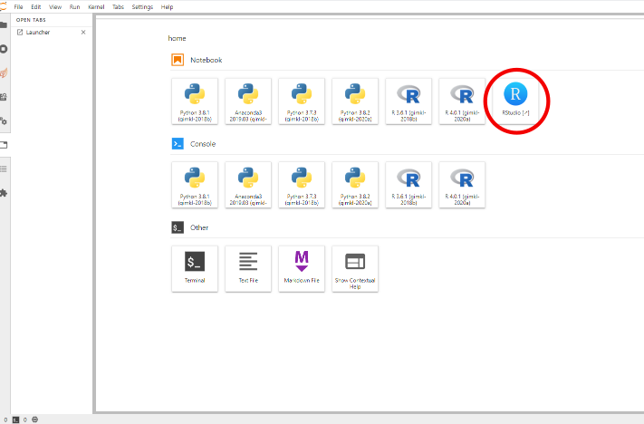

# RStudio on NeSI using jupyter-server-proxy

This repository contains a Python package that will help you run RStudio Server Open Source on [jupyter.nesi.org.nz](https://jupyter.nesi.org.nz).

Once intalled, it will add an option in the main interface of JupyterLab to start an instance of RStudio Server on the same computing node.
Note that the RStudio Server will not outlive the JupyterLab session.

**Note: this package is experimental, please note that breaking changes can and will happen.**


## Installation

1. Log in [jupyter.nesi.org.nz](https://jupyter.nesi.org.nz) and open a terminal (or log on NeSI using `ssh`).

2. Install the current package:
   ```
   pip install --user git+https://github.com/nesi/rstudio_on_nesi
   ```

3. Start a new instance on [jupyter.nesi.org.nz](https://jupyter.nesi.org.nz) and click on the RStudio icon to start it in a separate tab of your web browser.

Once installed, you should notice a new icon in the *launcher* interface.



When starting RStudio Server, the username requested is your **NeSI** login and the password is the one you defined in the `~/.config/rstudio_on_nesi/server_password` file.


## Configuration

`${XDG_CONFIG_HOME:=$HOME/.config}/rstudio_on_nesi/` is used for configs specific to this package:

- `server_password` contains password used to authenticate user and will be automatically populated with a random string if not set.
- `prelude.bash`, if exists, will be sourced before starting rstudio server. If R is not loaded here, the default version will be used.
- `singularity_image_path`, if exists, specifies the image file to use instead of the default. Useful for testing.

`${XDG_DATA_HOME:=$HOME/.local/share}/rstudio_on_nesi` is used for temporary files sockets etc.


## References

- https://jupyter-server-proxy.readthedocs.io
- https://github.com/jupyterhub/jupyter-rsession-proxy


## Maintenance

Maintenance notes are available in a [dedicated page](MAINTENANCE.md).
